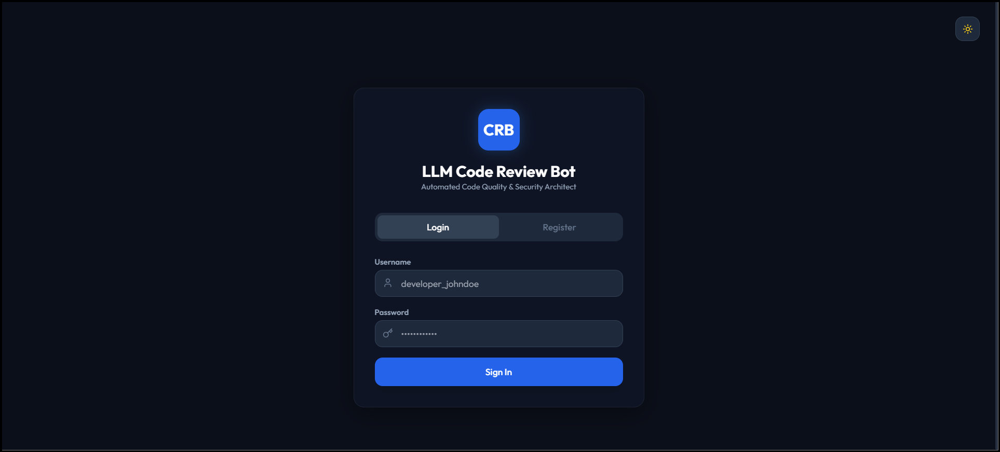
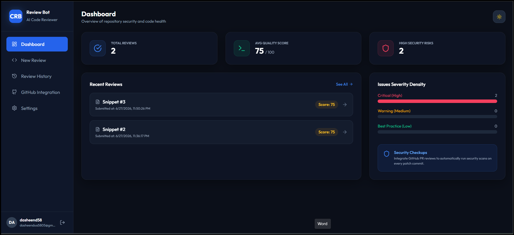
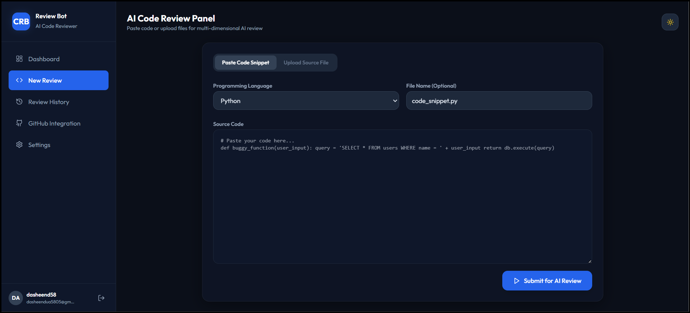
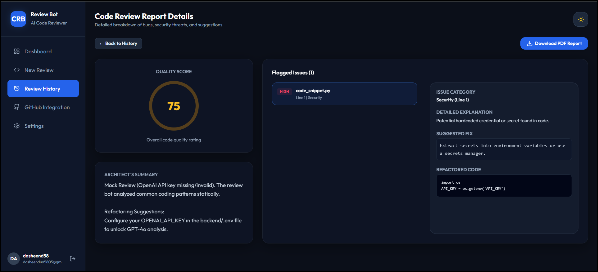
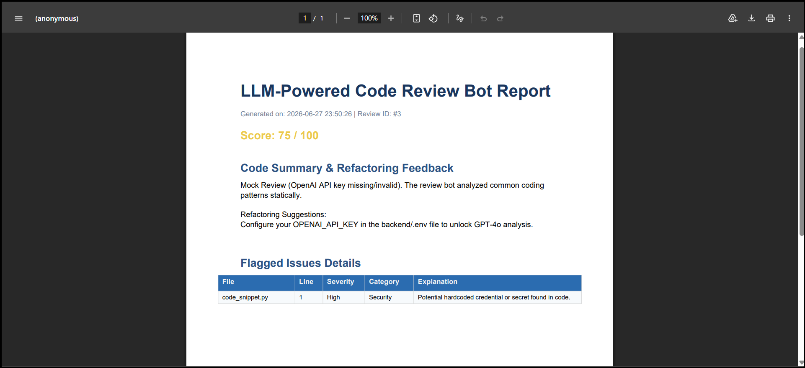

# LLM-Powered Code Review Bot

An AI-powered web application that reviews Python code, detects common issues, suggests improvements, and generates downloadable review reports.

---

## Features

- 🔐 User Authentication
- 📝 Submit Python code for review
- 🤖 AI-powered code analysis (OpenAI)
- 📊 Code Quality Score
- ⚠️ Security & Code Smell Detection
- 💡 Refactoring Suggestions
- 📄 Download PDF Review Reports
- 📚 Review History
- 🗄 SQLite Database
- 🌐 Responsive Web Interface

---

## Project Organization
```
code-review-bot/
├── backend/
│   ├── app.py                  # API endpoints, routing, and PDF Exporter
│   ├── database.py             # SQLite schema initialization
│   ├── models.py               # Data retrieval layer
│   ├── auth.py                 # JWT token decorators & PBKDF2 hashing
│   ├── rag_engine.py           # LangChain text splitter & NumPy vector search
│   ├── reviewer.py             # GPT-4o Prompt Logic & Fallback Mock Engine
│   ├── github_integration.py   # Webhook validation & GitHub Comment poster
│   ├── requirements.txt        # Backend dependencies
│   ├── Dockerfile              # Container building instruction
│   └── tests.py                # Unit test suite
├── frontend/
│   ├── templates/
│   │   └── index.html          # SPA template with React/Tailwind CDN
│   └── static/
│       ├── css/
│       │   └── style.css       # Visual styles and animations
│       └── js/
│           └── app.js          # React routing & views
├── standards_docs/             # Markdown docs used by RAG
│   ├── pep8.md
│   └── owasp_top_10.md
├── docs/
│   ├── deployment_guide.md     # Local & Cloud installation guide
│   ├── testing_strategy.md     # Automated and manual QA scripts
│   └── viva_questions.md       # College defense prep Q&A
├── docker-compose.yml          # Container composer configuration
├── README.md                   # Project landing page
└── resume_description.md       # Tailored CV snippets
```

---

## Tech Stack

### Backend
- Python
- Flask
- SQLite
- SQLAlchemy

### AI
- OpenAI API
- RAG-based architecture

### Frontend
- HTML
- CSS
- JavaScript

### Other
- Git
- GitHub

---

## Project Structure

```
backend/
frontend/
reports/
README.md
requirements.txt
```

---

## Installation

Clone the repository

```bash
git clone https://github.com/dasheendua58/llm-code-review-bot.git
```

Install dependencies

```bash
pip install -r backend/requirements.txt
```

Create a `.env` file inside `backend/`

```env
OPENAI_API_KEY=your_api_key_here
OPENAI_MODEL=gpt-4o
```

Run the application

```bash
python backend/app.py
```

Open

```
http://localhost:5000
```

---

## Screenshots

### Login Page



---

### Dashboard



---

### New Review



---

### Review Results



---

### PDF Report



---

## Current Limitation

If an OpenAI API key with available quota is not configured, the application automatically falls back to a mock review mode for demonstration purposes.

---

## Future Improvements

- GitHub Pull Request Review
- Multi-language Support
- Docker Deployment
- Team Collaboration
- Code Complexity Analysis
- CI/CD Integration

---

## Author

**Dasheen Dua**