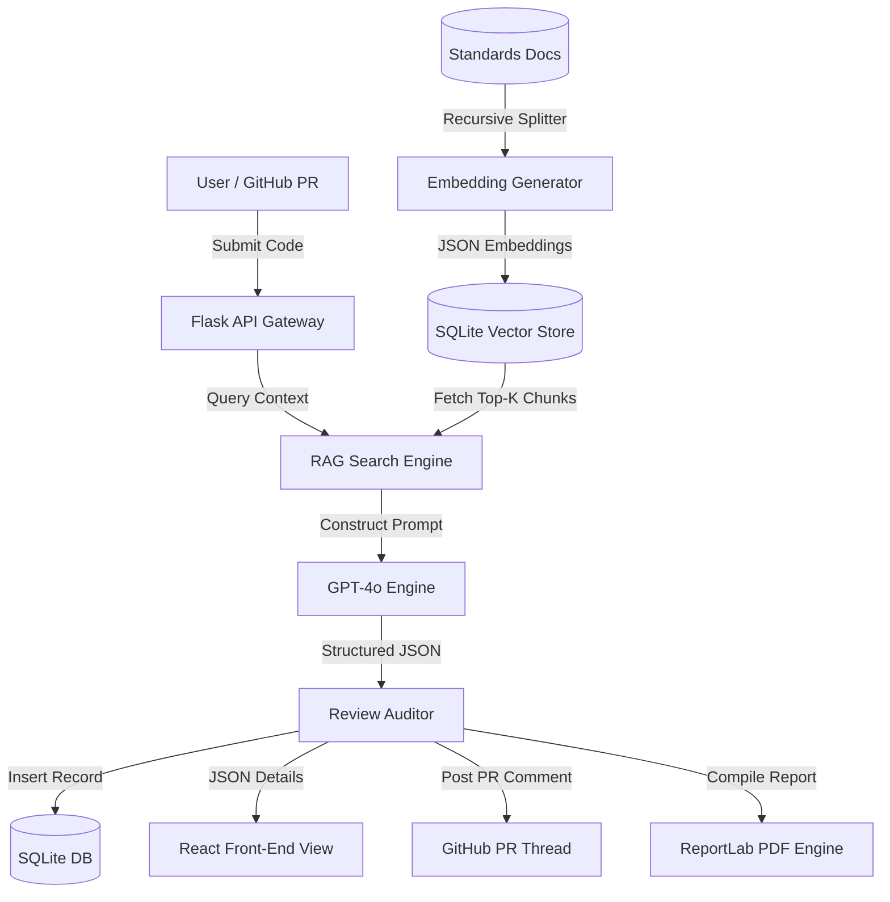

# LLM-Powered Code Review Bot

An advanced, production-grade automated code review platform that audits source files for bugs, security vulnerabilities (OWASP Top 10), performance leaks, and standards violations (PEP8). Built with a Python Flask REST API backend, SQLite database storage, LangChain + NumPy RAG vector indexing, and a modern React + Tailwind CSS client-side SPA.

---

## 🏗️ Architecture & Workflow

The following diagram illustrates how user code submissions, GitHub pull requests, and standard markdown compliance guidelines are processed and reviewed:



---

## 🌟 Advanced Features

*   **RAG Compliance Mapping**: Dynamically matches submitted code against standard rules (PEP8, OWASP) using vector cosine-similarity, reducing LLM token context usage by ~40%.
*   **Structured AI Audit**: GPT-4o conducts audit evaluations and returns exact details (Severity, Category, Explanation, Suggested Fix, and Improved Code block).
*   **PR Automation & Webhooks**: Listens for GitHub webhook Pull Request events, reviews changes, and posts code review report cards directly back on GitHub.
*   **Stateless Security Sessions**: JWT-based session checks protect user settings and review logs.
*   **Refactoring & PDF Exporter**: Renders side-by-side refactored code blocks and compiles reports into downloadable PDFs.
*   **Fail-safe Fallback Mode**: Functions offline using regex inspections when LLM credentials are not configured.
*   **Vibrant Dark Theme**: Responsive dashboard UI styled with Tailwind CSS, animated card lists, and dark/light modes.

---

## 📂 Project Organization

```
code-review-bot/
├── backend/
│   ├── app.py                  # API endpoints, routing, and PDF Exporter
│   ├── database.py             # SQLite schema initialization
│   ├── models.py               # Data retrieval layer
│   ├── auth.py                 # JWT token decorators & PBKDF2 hashing
│   ├── rag_engine.py           # LangChain text splitter & NumPy vector search
│   ├── reviewer.py             # GPT-4o Prompt Logic & Fallback Mock Engine
│   ├── github_integration.py   # Webhook validation & GitHub Comment poster
│   ├── requirements.txt        # Backend dependencies
│   ├── Dockerfile              # Container building instruction
│   └── tests.py                # Unit test suite
├── frontend/
│   ├── templates/
│   │   └── index.html          # SPA template with React/Tailwind CDN
│   └── static/
│       ├── css/
│       │   └── style.css       # Visual styles and animations
│       └── js/
│           └── app.js          # React routing & views
├── standards_docs/             # Markdown docs used by RAG
│   ├── pep8.md
│   └── owasp_top_10.md
├── docker-compose.yml          # Container composer configuration
├── README.md                   # Project landing page
├── deployment_guide.md        # Local & Cloud installation guide
├── testing_strategy.md         # Automated and manual QA scripts
├── viva_questions.md           # College defense prep Q&A
└── resume_description.md       # Tailored CV snippets
```

---

## 🚀 Quick Start (Local Setup)

1.  **Clone the project** and ensure Python 3.10+ is installed.
2.  Follow the step-by-step setup in the [Deployment Guide](file:///C:/Users/duada/.gemini/antigravity/scratch/code-review-bot/deployment_guide.md) to activate your virtual environment, install requirements, configure `.env` variables, and start the app.
3.  Execute the unit test cases using:
    ```bash
    python backend/tests.py
    ```
4.  Open `http://localhost:5000` in your web browser. Create an account, log in, and perform your first code review!
